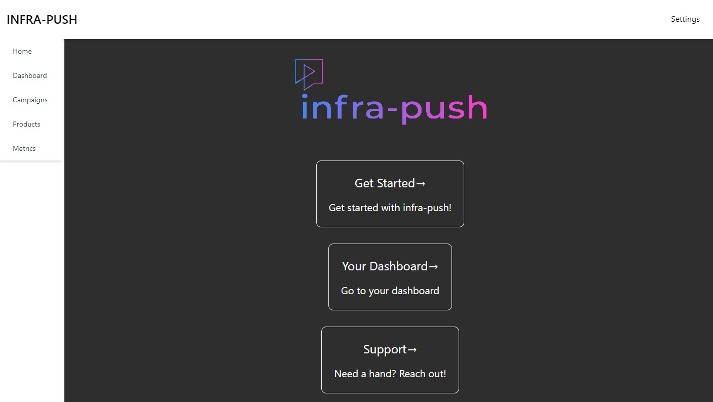

# Dynamic React Dashboard

I used this to learn how to connect a websocket to a dashboard.

i wanted the dashboard to be able to dynamically alter it's contents depending on what it got from the websocket.

As a final challange, be able to sent selctions and actions the user names back through the websocoket.


### Preview



### Prerequisites

This is javascript/react/next.js so it needs npm.

You can run this to install it locally
Mac/Linux
```
make install
```

Windows
```
make install-win
```

### Running 

You can run this in your local VS Code too.

(You must have run the install above beforehand of course)

Mac/Linux
```
make run
```

Windows
```
make run-win
```

